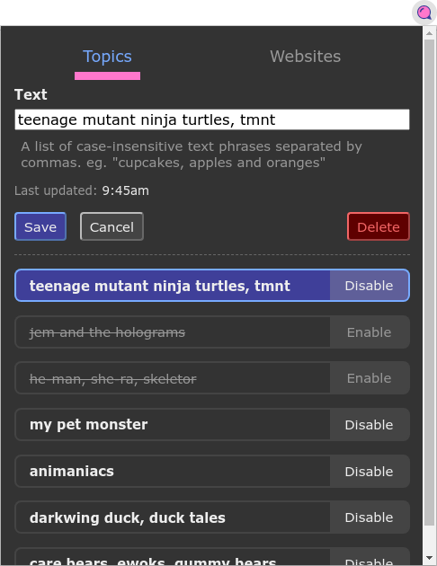
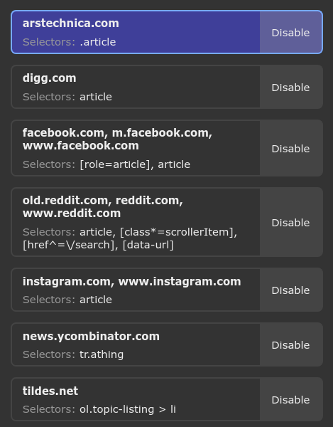

# Filter Bubble

A browser extension for
[Chrome](https://chrome.google.com/webstore/detail/cdfnpgngpkmlogkkeaafpdahppapgnoo/) and
[Firefox](https://addons.mozilla.org/en-CA/firefox/addon/filter-bubble/)
that helps you to filter-out content from the web.

Create a list of topics - groups of words or phrases - that you do not wish to see on the web.

Then configure website-specific
[CSS Selectors](https://developer.mozilla.org/en-US/docs/Web/CSS/CSS_Selectors)
to target HTML elements on a webpage.

If a "topic" is mentioned anywhere within one of these HTML elements, then it'll be hidden from view.

- [Install Filter Bubble for Chrome](https://chrome.google.com/webstore/detail/cdfnpgngpkmlogkkeaafpdahppapgnoo/)
- [Install Filter Bubble for Firefox](https://addons.mozilla.org/en-CA/firefox/addon/filter-bubble/)

## Getting Started

1. Install [node](https://nodejs.org/en/) > v10.19.0
1. Install [npm](https://www.npmjs.com/) > v6.14.4
1. `npm install`
1. `npm run web-ext`





## Developing for Android

Follow the [Extension Workshop guide](https://extensionworkshop.com/documentation/develop/developing-extensions-for-firefox-for-android/):

- [Enable Android "Developer Options"](https://developer.android.com/studio/debug/dev-options)
- [Remote Debugging via USB](https://developer.mozilla.org/en-US/docs/Tools/about:debugging#Setup_tab) in Firefox for Android
- Connect your device to your computer via USB
- Install [Android Platform Tools](https://developer.android.com/studio/releases/platform-tools.html)

```bash
sudo apt install adb

# You may need to restart the adb server if you have a previous manual installation
sudo adb kill-server
sudo adb start-server

adb devices
```

Your device will now prompt you to authorize the computer. Once authorized, continue with the [instructions for web-ext](https://extensionworkshop.com/documentation/develop/getting-started-with-web-ext/#testing-in-firefox-for-android):

```bash
device="$(adb devices  2>&1| awk '/./{device=$1} END{print device}')"
echo Device \"${device}\"

./node_modules/.bin/web-ext run --target=firefox-android --android-device=${device}

# If you have multiple Firefox versions installed, then you can disambiguate using the `--firefox-apk` flag.
./node_modules/.bin/web-ext run \
    --target=firefox-android \
    --android-device=${device} \
    --firefox-apk=org.mozilla.firefox
```

You can also use these npm run-scripts:

- `npm run web-ext-android-firefox`
- `npm run web-ext-android-firefox-preview-nightly`

## Publishing

* [Chrome](https://chrome.google.com/webstore/devconsole/)
* [Firefox](https://addons.mozilla.org/en-US/developers/addons)

```bash
npm run package
ls web-ext-artifacts/
```
