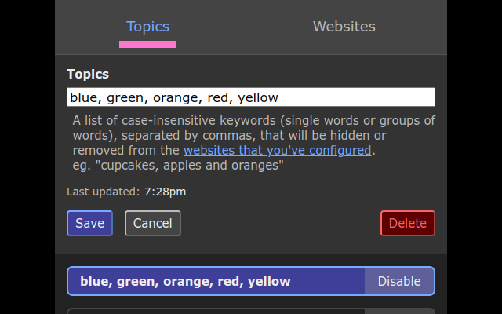
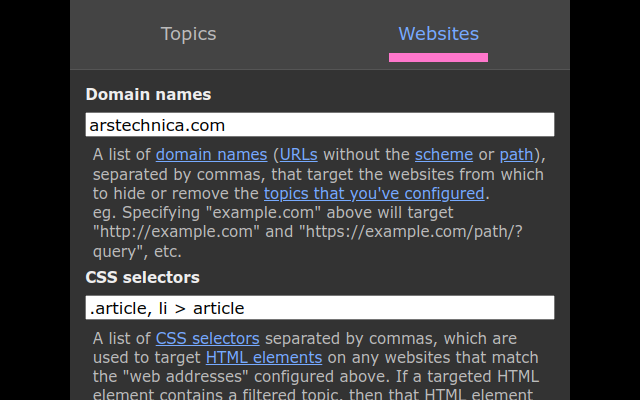

# Filter Bubble

Filter Bubble is a Chrome and Firefox browser extension that hides web content matching topics you don't want to see.

- [Install for Chrome](https://chromewebstore.google.com/detail/cdfnpgngpkmlogkkeaafpdahppapgnoo)
- [Install for Firefox](https://addons.mozilla.org/en-CA/firefox/addon/filter-bubble/)

[](./resources/screenshots/screenshot-topics.png)

## How it works

1. Add the **topics** you want to hide.
1. For each website, add [CSS selectors](https://developer.mozilla.org/en-US/docs/Web/CSS/CSS_selectors) that target the content blocks or feed items that might contain those topics.
1. When a topic appears inside a targeted element on that website, the element is hidden or removed.

A handful of websites are configured out of the box. Adding others requires targeting [HTML elements](https://developer.mozilla.org/en-US/docs/Web/HTML/Element) with [CSS selectors](https://developer.mozilla.org/en-US/docs/Web/CSS/CSS_selectors) yourself.

[](./resources/screenshots/screenshot-websites.png)

## Developing

1. Install [Node](https://nodejs.org/) (see [`.nvmrc`](.nvmrc) for the version)
1. `npm install`
1. `npm start`

`npm test`, `npm run lint`, and `npm run build` cover the rest; [`package.json`](./package.json) lists every script.

### Android

`npm run start:android` runs the extension on a USB-connected device. See the [Extension Workshop guide](https://extensionworkshop.com/documentation/develop/developing-extensions-for-firefox-for-android/) for the full walkthrough; the short version:

1. Enable Android developer options and USB debugging, and turn on "Remote Debugging via USB" in Firefox for Android.
1. Install `adb`: `sudo apt install adb`
1. On Linux, grant USB access with a udev rule (replace `idVendor` with the value from `dmesg`):

   ```bash
   echo 'SUBSYSTEM=="usb", ATTR{idVendor}=="18d1", MODE="0666", GROUP="plugdev"' \
     | sudo tee /etc/udev/rules.d/50-android-usb.rules
   ```

1. Connect the device, run `adb devices`, and authorize the computer when prompted.
1. Run `npm run start:android`.

### Publishing

Tagged releases (`v*`) build a packaged extension via [GitHub Actions](.github/workflows/ci.yml):

1. Match `version` in [`package.json`](./package.json) and [`manifest.json`](./manifest.json).
1. Commit, then tag and push:

   ```bash
   git tag v0.x.x
   git push && git push --tags
   ```

Build locally with `npm run package` (output in `web-ext-artifacts/`). Store dashboards: [Chrome](https://chromewebstore.google.com/devconsole/), [Firefox](https://addons.mozilla.org/en-US/developers/addons).
