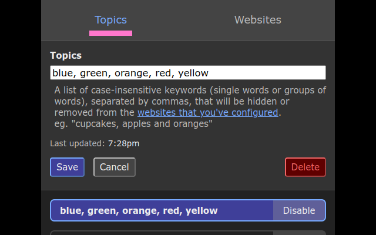

# Filter Bubble

Filter Bubble is a browser add-on/extension for
[Chrome](https://chrome.google.com/webstore/detail/cdfnpgngpkmlogkkeaafpdahppapgnoo/) and
[Firefox](https://addons.mozilla.org/en-CA/firefox/addon/filter-bubble/)
that enables you to hide content that you don't want to see on the web.

- [Install Filter Bubble for Chrome](https://chrome.google.com/webstore/detail/cdfnpgngpkmlogkkeaafpdahppapgnoo/)
- [Install Filter Bubble for Firefox](https://addons.mozilla.org/en-CA/firefox/addon/filter-bubble/)

## How it works

1. Create a list of "topics" that you want to hide or remove from specific websites
1. Configure rules for these websites by specifying
   [CSS selectors](https://developer.mozilla.org/en-US/docs/Web/CSS/CSS_selectors)
   that target the
   [HTML elements](https://developer.mozilla.org/en-US/docs/Web/HTML/Element)
   of the content blocks or feed items that might contain any of the targeted topics
1. If a targeted topic appears in a targeted HTML element on a targeted website, then it'll be hidden or removed from view

n.b. Only a handful of websites are configured out of the box, and you'll need to know how to target
[HTML elements](https://developer.mozilla.org/en-US/docs/Web/HTML/Element) using
[CSS selectors](https://developer.mozilla.org/en-US/docs/Web/CSS/CSS_selectors) in order to configure additional websites!




## Developing

### Getting Started

1. Install [node](https://nodejs.org/en/) > v10.19.0
1. Install [npm](https://www.npmjs.com/) > v6.14.4
1. `npm install`
1. `npm run web-ext`

### Developing for Android

Follow the [Extension Workshop guide](https://extensionworkshop.com/documentation/develop/developing-extensions-for-firefox-for-android/):

- [Enable Android "Developer Options"](https://developer.android.com/studio/debug/dev-options)
- [Remote Debugging via USB](https://developer.mozilla.org/en-US/docs/Tools/about:debugging#Setup_tab) in Firefox for Android
- Connect your device to your computer via USB
- Install [Android Platform Tools](https://developer.android.com/studio/releases/platform-tools.html)
- Enable "Remote Debugging via USB" from Firefox Android -> Settings -> Developer Tools
- Create `/etc/udev/rules.d/50-android-usb.rules` with the following content:

  ```bash
  SUBSYSTEM=="usb", ATTR{idVendor}=="18d1", MODE="0666", GROUP="plugdev"
  ```

  Replace the value for `idVendor` with the one from `dmesg`, eg:

  ```bash
  New USB device found, idVendor=18d1, idProduct=4ee7, bcdDevice= 5.15
  ```

```bash
sudo apt install adb android-sdk-platform-tools-common

# You may need to restart the adb server if you have a previous manual installation
sudo adb kill-server
sudo adb start-server

adb devices
```

Your device will now prompt you to authorize the computer. Once authorized, continue with the [instructions for web-ext](https://extensionworkshop.com/documentation/develop/getting-started-with-web-ext/#testing-in-firefox-for-android):

```bash
device="$(adb devices  2>&1| awk '/./{device=$1} END{print device}')"
echo Device \"${device}\"

./node_modules/.bin/web-ext run --target=firefox-android --android-device=${device}

# If you have multiple Firefox versions installed, then you can disambiguate using the `--firefox-apk` flag.
./node_modules/.bin/web-ext run \
    --target=firefox-android \
    --android-device=${device} \
    --firefox-apk=org.mozilla.firefox
```

You can also use these npm run-scripts:

- `npm run web-ext-android-firefox`

### Publishing

- [Chrome](https://chrome.google.com/webstore/devconsole/)
- [Firefox](https://addons.mozilla.org/en-US/developers/addons)

```bash
npm run package-production
ls web-ext-artifacts/
```
